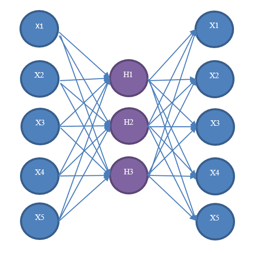

# Autoencoders in SAS Viya

An autoencoder is a multilayer perceptron neural network that is used for efficient encoding/decoding, and it is widely used for feature extraction and nonlinear principal component analysis. Architecturally, an autoencoder is similar to a regular multilayer perceptron neural network because it has an input layer, hidden layers, and an output layer. However, it differs in that the output layer is duplicated from the input layer. Therefore, autoencoders are unsupervised learning models. 

For examples of implementing autoencoders in SAS 9.4, see [SAS_Neural_Autoencoder](https://github.com/sassoftware/enlighten-deep/tree/master/SAS_Neural_Autoencoder)
